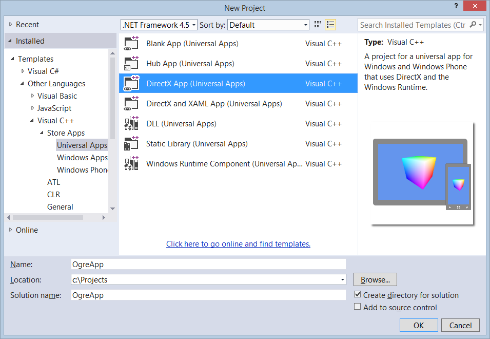

```
layout: post 
title: Getting Started Guide using OGRE 3D and Universal Projects 
tags: ['Game Development', 'Graphics', '3D', 'OGRE 3D', 'Windows 8.1', 'Windows Phone 8.1', 'C++', 'DirectX'] 
date: 11/14/2014 1:00:00 PM 
draft: false 
url: /mathoms/getting-started-guide-using-ogre-3d-and-universal-projects.html
```

<p>[OGRE](http://ogre3d.org)
(**O**bject-Oriented **G**raphics **R**endering **E**ngine) is a scene-oriented, flexible 3D engine written in C++ designed to make it easier and more intuitive for developers to produce applications utilizing hardware-accelerated 3D graphics. The class library abstracts all the details of using the underlying system libraries like Direct3D and OpenGL and provides an interface based on world objects and other intuitive classes. In recent releases, OGRE has added support for Windows 8.1 and Windows Phone 8.1. Since the support is fairly new, getting OGRE ready for building games for these platforms can be a little tricksy, this guide is intended to reduce the friction of getting a game started using OGRE.</p>

By following this guide, which is very similar to [another post](getting-started-guide-using-ogre-3d-on-windows-8-1) I did on OGRE, you will be able to start building your next game targeting Windows and Windows Phone 8.1 devices. The best method for using OGRE is to build it from source and then build your projects on top of that build. A primary benefit of compiling from source is that you can keep updated with the latest bug fixes. This also allows you to step into the OGRE source while debugging, if you need to, in order to solve the trickier rendering problems.

Getting Ready
-------------

As this guide is targeting Windows and Windows Phone 8.1, you’ll need to have a working installation of Windows 8.1 and Visual Studio 2013. If you are using the Express editions of Visual Studio, make sure you are using the [Visual Studio Express for Windows](http://go.microsoft.com/?linkid=9832263), and not Visual Studio Express for Windows Desktop.

To get started you’ll need to have a couple of additional pieces of software installed. These will allow you to download and configure the OGRE source tree for compilation. Use the links below to download and install the additional software.

[SourceTree](https://www.atlassian.com/software/sourcetree/overview "A free Mercurial and Git client for Windows or Mac") - a [Mercurial](http://mercurial.selenic.com/ "Mercurial is a free, distributed source control management tool.")
source control client.

 **OR**

[Mercurial Command Line Interface](http://mercurial.selenic.com/release/windows/Mercurial-3.2.exe) - Mercurial is a Distributed Version Control System (DVCS) similar to git and Bazaar. If you are not using SourceTree, you'll need this.

[CMake](http://www.cmake.org/files/v3.1/cmake-3.1.0-rc1-win32-x86.exe) - a cross-platform, open-source build system. This is a pre-release build of version 3.1 which includes support for Windows Store and Windows Phone Store projects. Mak sure you download and install this version if you have a previous version of CMake installed.

Sourcetree is not a requirement if you already have a Mercurial (Hg) client installed or prefer the command line clients, however, even if you do, I suggest you give SourceTree a look. It has to be one of the best graphical Git/Mercurial clients on the market today. It’s free to boot! Instructions in this post will refer to using SourceTree and the command line tools.

CMake is required by OGRE to configure the source tree for building with either MSBuild or the Visual Studio IDE.

Prepare a sandbox environment
-----------------------------

When working with large complex systems like OGRE, I like to keep it sandboxed so there is little chance of messing up the rest of my system, It also makes for easier cleanup. There are two simple steps to creating our sandbox:

1.  **Create a new folder**<br>
    I keep all my projects in a folder named ```Projects``` under my ```C:\\``` drive. For my sandbox, I am creating a folder called ```OGRE``` under the Projects folder. This will serve as the root of my sandbox. Open ```PowerShell``` window and enter the following commands:

	```bash
	mkdir C:\Projects
	mkdir C:\Projects\OGRE
	```

2.  **Create the build folder**<br>
	While you have the ```PowerShell``` window open enter

    ```bash
    mkdir C:\Projects\OGRE\WINRT81
    ```

    to create a folder we will use to hold our build files. We use a separate folder here so contain the dependencies and build files, which include the solution files, project files, special headers and all build outputs, because they are platform specific.

Building the Dependencies
-------------------------

In order to build OGRE we must first build the projects that it depends on. Fortunately for us, this is a fairly simple and painless exercise.

#### Clone the Dependency repository

Open ```SourceTree``` and click the ```Clone / New``` toolbar button to open the ```Clone / Add / Create Repository``` dialog box. In the ```Sourcepath / Url``` field enter the text “**https://bitbucket.org/eugene_gff/ogre-dependencies-winrt**”. For the ```Destination Path``` enter “**C:\Projects\OGRE\WINRT81\Dependencies**”.
[](/Media/Default/Windows-Live-Writer/b19290c229c6_854A/image_4.png)

When you click ```Clone```, SourceTree will begin to clone (copy) the source locally.

**OR**

If you are using the command line Mercurial client, then in your ```PowerShell``` window, type the following command:
```bash
hg clone https://bitbucket.org/eugene_gff/ogre-dependencies-winrt C:\Projects\OGRE\WINRT81\Dependencies
```

#### Build the Dependencies

When that completes, open a ```File Explorer``` window and browse to “**C:\Projects\OGRE\WINRT81\Dependencies\src\**” and open the ’OgreDependencies.VS2013.WinRT.sln’ file. Select ```Build```, then ```Batch Build…```, click ```Select All```, finally click ```Build``` and everything should complete successfully.

[](/Media/Default/Windows-Live-Writer/b19290c229c6_854A/image_6.png)

This will take a few minutes to complete even on a fast machine, so be patient. Once the build is complete, you can find all the outputs (.lib) files in the “C:\Projects\OGRE\WINRT81\Dependencies\lib”, e.g “C:\Projects\OGRE\WINRT81\Dependencies\lib\x64\Debug\FreeImaged.lib”.

Once the build completes successfully, you can close the ```Visual Studio 2013``` window.

Congratulations, you have completed part one of the quest. But do not bask in the glory of your success for too long, seasoned warrior, for more adventures await you.

Building OGRE
-------------

Now that the dependencies have been built we can focus on building the core libraries of OGRE. OGRE can be built as either static libs or as DLL’s. To make things simpler at runtime, we will be building OGRE as static libraries, this means that all of the OGRE code will be linked into our games at build time, ideally, this will reduce the amount if time it takes to load our game.

#### Clone the OGRE repository

Open ```SourceTree``` again in order to clone the OGRE repository. Click the ```Clone / New``` toolbar button again to open the ```Clone / Add / Create Repository``` dialog box. This time use “**https://bitbucket.org/sinbad/ogre**” for the ```Sourcepath / Url``` field and “**C:\\Projects\\OGRE\\src**” for the ```Destination Path```. Click the ```Clone``` button to begin the download of the OGRE source.

[](/Media/Default/Windows-Live-Writer/b19290c229c6_854A/image_8.png)

**OR**

If you are using the command line Mercurial Client, then in your PowerShell window, type the following command:
```bash
hg clone https://bitbucket.org/sinbad/ogre C:\Projects\OGRE\src
```
#### Configure the Build

The next steps we need to build the OGRE libraries for both the Windows 8.1 and Windows Phone 8.1 platforms. The steps are essentially the same but each platform uses different paths and settings. We'll tackle doing the Windows build first followed by the Windows Phone build.

> **TIP:** The next few steps are where things could go wrong. However, it’s also easy to clean up and start again from this point forward. Just delete the “C:\\Projects\\OGRE\\WINRT81\\*build*” folder, where *build* is either **win** or **phone** which we are about to create, and start again.

This is the part where we need to use CMake. As I stated earlier, CMake is a build system, and the OGRE project is using it to tailor the solution and project files exactly as we need them for each platform since there can be a lot of variation in how to build for Windows vs MacOS vs Linux. In our case we will want to create build folders for Windows 8.1 and Windows Phone 8.1. As of this writing, CMake and OGRE do not support the new Universal App projects so we will need to keep separate builds for each platform. 

##### Windows 8.1

 Tap
your Windows key to launch the start screen, and then type “**cmake-gui**” to search for the graphical interface for CMake, which I find a lot easier to use.

In the ```cmake-gui``` window, enter “**C:\\Projects\\OGRE\\src**” for the ```Where is the source code``` field, and “**C:\\Projects\\OGRE\\WINRT81\\win**” for the ```Where to build the binaries``` field. Two-thirds of the way down the window you will find a couple of buttons ```Configure``` and ```Generate```. Click the ```Configure``` button now to allow CMake to figure out what else it needs from you.

[](CMAKE-WIN81-1.png) 

<a href="CMAKE-WIN81-2.png" ></a>It will first ask you to create the build folder, click ```yes``` and allow it. The next dialog to be displayed is to select which IDE we will be using to edit and compile the OGRE source code in. If you drop the selection down, you can see the list of supported IDE’s. Since we are targeting Windows 8.1, we need to use Visual Studio 2013, so select  ```Visual Studio 12 2013```. Change the default compiler selection to ```Specify options for cross-compiling```. We will use the options to specify the platform and version to build for. Click ```Next >``` to open the ```cross-compiling options``` dialog. 

In the ```cross-compiling options``` dialog box, enter “**WindowsStore**” for the ```Operating System``` field and “**8.1**” for the ```Version``` field. Click ```Finish```


```CMake``` will scan your system looking for all the pieces it needs to properly configure your build folders to compile OGRE for the Windows 8.1 platform. The bottom window dispays the output of the various tests and searches that CMake is doing. In the middle it will list any chamged options that it discovers. Do not be concerned about the amount of red lines in the display. CMake displays new or changed entries in red.

[](CMAKE-WIN81-4.png) 

We will make a few adjustments to these options, then re-configure. Near the middle of the list you’ll find an entry called ```OGRE_DEPENDENCIES_DIR``` and more than likely it will be blank. We will need to tell CMake where to find the libraries we just built. Select that entry and either type, or browse for “**C:\\Projects\\OGRE\\WINRT81\\Dependencies\\**”. Now find the entry called ```OGRE_STATIC``` and check the box to the right. click ```Configure``` again, since we made changes to the settings. Once all the red is gone, click ```Generate``` to complete this step.

##### Windows Phone 8.1
Back in the ```cmake-gui``` window, enter “**C:\\Projects\\OGRE\\src**” for the ```Where is the source code``` field, and “**C:\\Projects\\OGRE\\WINRT81\\phone**” for the ```Where to build the binaries``` field. The configuration options should clear out from the last time because the "phone" folder doesn't exist yet. Click the ```Configure``` button now to allow CMake to figure out what else it needs.

[](CMAKE-PHONE81-1.png) 

<a href="CMAKE-PHONE81-2.png" ></a>At the prompt to create the build folder, click ```yes``` and allow it. Since we are targeting Windows Phone 8.1, we still need to use Visual Studio 2013, so select  ```Visual Studio 12 2013``` and Change the default compiler selection to ```Specify options for cross-compiling``` in the next dialog. Just like we did for Windows 8.1, we will use the options to specify the platform and version to build for. Click ```Next >``` to open the ```cross-compiling options``` dialog. 

In the ```cross-compiling options``` dialog box, enter “**WindowsPhone**” for the ```Operating System``` field and “**8.1**” for the ```Version``` field. Click ```Finish```


```CMake``` will, again, scan your system looking for all the pieces it needs to properly configure your build folders to compile OGRE for Windows Phone 8.1.

[](CMAKE-PHONE81-4.png) 

We will make the same adjustments to these options, then re-configure. Find the entry called ```OGRE_DEPENDENCIES_DIR``` and either type, or browse for “**C:\\Projects\\OGRE\\WINRT81\\Dependencies\\**”. Then, find the entry called ```OGRE_STATIC``` and check the box to the right. click ```Configure``` again, since we made changes to the settings. Once all the red is gone, click ```Generate``` to create the Windows Phone project files.

We are now done with the ```cmake-gui``` tool so you can safely close the window.

#### Build OGRE libraries

Just as it took two major steps to configure the OGRE libraries, so too will it take two large steps to compile the libraries. Fortunately since the updates to CMAKE and OGRE this is much easier than it was in the past.

For the Windows 8.1 libraries, open ```Visual Studio 2013```, then open the “**C:\Projects\OGRE\WINRT81\win\ogre.sln**” solution. Right-Click the ```Solution 'OGRE'``` node in the ```Solution Explorer``` toolwindow and select ```Build Solution```. Everything should complete successfully (it takes a while, you may want to take a bio-break).


For the Windows Phone 8.1 libraries, open ```Visual Studio 2013```, then open the “**C:\Projects\OGRE\WINRT81\phone\ogre.sln**” solution. Right-Click the ```Solution 'OGRE'``` node in the ```Solution Explorer``` toolwindow and select ```Build Solution``` and everything should complete successfully. If you've already taken your bio-break, time to walk the dog or cat or your pet rock.
> **NOTE:** As of this writing, there is a bug in the generation of the Windows Phone projects. The ```Sample_CubeMapping``` project has a file added that is not needed, you can Right-Click the ```{file}``` and select ```Exclude from Project```.
 
#### Test Your Builds

Now that you have gone through all this effort, lets make sure that the Samples run correctly. If you have the Windows 8.1 solution still open, tab over to it, otherwise open it back up again. What? You thought we were done?

In the ```Solution Explorer``` tool window, find the ```SampleBrowser```, it should be at the bottom, Right-Click it and select ```Set as Startup Project```. You should now be able to run the samples by clicking the button.

Follow the same steps above for the Windows Phone solution. The samples will run in the Windows Phone emulator.

[](OGRESAMPLES-PHONE81.png)
[](OGRESAMPLES-WIN81.png) 

 

Creating a Universal Test Application
---------------------------

What a long trek! I hope you haven't given up yet, we are nearing the end, and at last we are at a point where we can begin to use the Universal App templates in Visual Studio 2013.

The first step is to open a new instance of Visual Studio 2013. Then create a new project based on the DirectX Windows Store App project template. You can find this in the ```New Project``` dialog box under ```Visual C++/Windows Store```. Make sure you don't select the ```DirectX and XAML (Universal Apps)``` template, I might cover how to use that one in a later post, but for now, we want to use the ```DirectX App (Universal Apps)``` project template.

[](File-NewProject-WindowsStore-DirectXApp.png)

I used the name “**OgreUniversalApp**”, feel free to use what ever name you want. You can also put this in any folder that you want, I generally keep my OGRE projects separate from the OGRE builds I am using. Click ```OK``` to create the project.

We will use only Debug mode for the purposes of this introduction, but you will need to make similar changes described below for Release mode.

#### Windows 8.1
Right-Click the ```OgreUniversalApp.Windows (Windows 8.1)``` project in the ```Solution Explorer``` and select ```Properties```.

Open ```Configuration Properties``` -\> ```C/C++``` -\> ```General``` -\> ```Additional Include Directories``` and click the ```…``` to open the editor window. Add the following entries :

```bash
C:\Projects\OGRE\WINRT81\src\include
C:\Projects\OGRE\WINRT81\src\OgreMain\Include
C:\Projects\OGRE\WINRT81\win\include
C:\Projects\OGRE\WINRT81\src\Components\RTShaderSystem\include
C:\Projects\OGRE\WINRT81\src\RenderSystems\Direct3D11\include
C:\Projects\OGRE\WINRT81\src\PlugIns\OctreeSceneManager\include
```

Add “**C:\Projects\OGRE\WINRT81\win\lib\debug**” and “**C:\Projects\OGRE\WINRT81\win\Dependencies\lib\x86\Debug**” to ```Configuration Properties``` -\> ```Linker``` -\> ```General``` -\> ```Additional Library Directories```

Open ```Configuration Properties``` -\> ```Linker``` -\> ```Input``` -\> ```Additional Dependencies``` and click the ```…``` to open the editor window. replace the contents with the entries below:

```bash
uuid.lib
dxgi.lib
dxguid.lib
d3dcompiler.lib
d2d1.lib
d3d11.lib
ole32.lib
windowscodecs.lib
dwrite.lib
OgreMainStatic_d.lib
FreeImaged.lib
freetype2311_d.lib
zlibd.lib
zziplibd.lib
RenderSystem_Direct3D11Static_d.lib
OgreRTShaderSystemStatic_d.lib
Plugin_OctreeSceneManagerStatic_d.lib
```
### Windows Phone 8.1
Now lets make similar changes to the Windows Phone 8.1 project so that we can compile and run code that uses OGRE. Right-Click the ```OgreUniversalApp.Windows (Windows 8.1)``` project in the ```Solution Explorer``` and select ```Properties```.
Open ```Configuration Properties``` -\> ```C/C++``` -\> ```General``` -\> ```Additional Include Directories``` and click the ```…``` to open the editor window. Add the following entries :

```bash
C:\Projects\OGRE\src\include
C:\Projects\OGRE\src\OgreMain\Include
C:\Projects\OGRE\WINRT81\phone\include
C:\Projects\OGRE\src\Components\RTShaderSystem\include
C:\Projects\OGRE\src\RenderSystems\Direct3D11\include
C:\Projects\OGRE\src\PlugIns\OctreeSceneManager\include
```

Add “**C:\Projects\OGRE\WINRT81\phone\lib\debug**” and “**C:\Projects\OGRE\WINRT81\phone\Dependencies\lib\x86\Debug**” to ```Configuration Properties``` -\> ```Linker``` -\> ```General``` -\> ```Additional Library Directories```

Open ```Configuration Properties``` -\> ```Linker``` -\> ```Input``` -\> ```Additional Dependencies``` and click the ```…``` to open the editor window. replace the contents with the entries below:

```bash
WindowsPhoneCore.lib
RuntimeObject.lib
PhoneAppModelHost.lib
uuid.lib
dxgi.lib
dxguid.lib
d3dcompiler.lib
d2d1.lib
d3d11.lib
windowscodecs.lib
dwrite.lib
OgreMainStatic_d.lib
FreeImaged.lib
freetype2311_d.lib
zlibd.lib
zziplibd.lib
RenderSystem_Direct3D11Static_d.lib
OgreRTShaderSystemStatic_d.lib
Plugin_OctreeSceneManagerStatic_d.lib
```
### Test the Changes
Now to test these changes, Open ```App.h``` in the ```OgreApp.Shared``` project and add :

```cpp
#include “Ogre.h”
```

at the end of the includes. The project should successful build at this time, if it doesn’t check to make sure you have made the changes above correctly. Run the App in the Windows simulator and Windows Phone Emulator to verify the deployment and linkages are all correct too.

### Creating the OGRE App

The next few steps are fairly basic OGRE tutorial type things, I am not going to go into a lot of detail here on how OGRE works, There are some great tutorials on the OGRE wiki that you can read through to see what is going on.

We are using the RTShaderGenerator component, which generates and compiles shader programs on the fly. This is only available on Windows and Windows Phone 8.1, not 8.0. The RTShaderGenerator was built to help bridge the gap from DirectX 9 which had a Fixed Function Pipeline and DirectX 10 and later which removed it. It is also very handy to create the needed shaders instead of hand coding them early on in your development process.

To get you’re the started, update the App.h and App.cpp in the ```OgreUniversalApp.Shared``` project with the listings below. They are fairly well commented so you should be able to follow the program.

The App is very simple, it will paint the background white, and add a model of the OGRE head in the center of the screen. It’s about as simple as you can get.

### App.h

```cpp
#pragma once

#include "pch.h"

#include "Ogre.h"
#include "OgreD3D11Plugin.h"
#include "OgreOctreePlugin.h"
#include "OgreRTShaderSystem.h"

#include "ShaderGeneratorTechniqueResolverListener.h"

#include <string>

namespace SampleOgreApp
{
    // Main entry point for our app. Connects the app with the Windows shell and handles application lifecycle events.
    ref class App sealed : public Windows::ApplicationModel::Core::IFrameworkView
    {
    public:
        App();
        virtual ~App();

        // IFrameworkView Methods.
        virtual void Initialize(Windows::ApplicationModel::Core::CoreApplicationView^ applicationView);
        virtual void SetWindow(Windows::UI::Core::CoreWindow^ window);
        virtual void Load(Platform::String^ entryPoint);
        virtual void Run();
        virtual void Uninitialize();

    protected:
        // Application lifecycle event handlers.
        void OnActivated(Windows::ApplicationModel::Core::CoreApplicationView^ applicationView, Windows::ApplicationModel::Activation::IActivatedEventArgs^ args);
        void OnSuspending(Platform::Object^ sender, Windows::ApplicationModel::SuspendingEventArgs^ args);
        void OnResuming(Platform::Object^ sender, Platform::Object^ args);

        // Window event handlers.
        void OnWindowSizeChanged(Windows::UI::Core::CoreWindow^ sender, Windows::UI::Core::WindowSizeChangedEventArgs^ args);
        void OnVisibilityChanged(Windows::UI::Core::CoreWindow^ sender, Windows::UI::Core::VisibilityChangedEventArgs^ args);
        void OnWindowClosed(Windows::UI::Core::CoreWindow^ sender, Windows::UI::Core::CoreWindowEventArgs^ args);

        // DisplayInformation event handlers.
        void OnDpiChanged(Windows::Graphics::Display::DisplayInformation^ sender, Platform::Object^ args);
        void OnOrientationChanged(Windows::Graphics::Display::DisplayInformation^ sender, Platform::Object^ args);
        void OnDisplayContentsInvalidated(Windows::Graphics::Display::DisplayInformation^ sender, Platform::Object^ args);

    private:
        bool m_windowClosed;
        bool m_windowVisible;

        Ogre::Root* mOgreRoot;
        Ogre::RenderWindow* mOgreRenderWindow;

        Ogre::D3D11Plugin* mD3D11Plugin;
        Ogre::OctreePlugin* mOctreePlugin;

        Ogre::RTShader::ShaderGenerator* mShaderGenerator;                       // The Shader generator instance.
        ShaderGeneratorTechniqueResolverListener* mMaterialMgrListener;          // Shader generator material manager listener.

        void CreateShadersForDefaultMaterialsUsingRTSS();

        std::string ConvertPlatformStringToSTDString(Platform::String^ s);
        Platform::String^ ConvertSTDStringToPlatformString(const std::string& s);
    };
}

ref class Direct3DApplicationSource sealed : Windows::ApplicationModel::Core::IFrameworkViewSource
{
public:
    virtual Windows::ApplicationModel::Core::IFrameworkView^ CreateView();
};
```

### App.cpp

```cpp
#include "pch.h"
#include "App.h"

#include <ppltasks.h>

using namespace SampleOgreApp;

using namespace concurrency;
using namespace Windows::ApplicationModel;
using namespace Windows::ApplicationModel::Core;
using namespace Windows::ApplicationModel::Activation;
using namespace Windows::UI::Core;
using namespace Windows::UI::Input;
using namespace Windows::System;
using namespace Windows::Foundation;
using namespace Windows::Graphics::Display;

// The main function is only used to initialize our IFrameworkView class.
[Platform::MTAThread]
int main(Platform::Array<Platform::String^>^)
{
    auto direct3DApplicationSource = ref new Direct3DApplicationSource();
    CoreApplication::Run(direct3DApplicationSource);
    return 0;
}

IFrameworkView^ Direct3DApplicationSource::CreateView()
{
    return ref new App();
}

App::App() :
m_windowClosed(false),
m_windowVisible(true),
mOgreRoot(nullptr)
{
}

App::~App()
{
    delete mOgreRoot;
}

std::string App::ConvertPlatformStringToSTDString(Platform::String^ s)
{
    // need to convert to narrow (OEM or ANSI) codepage so that fstream can use it 
    // properly on international systems.
    char npath[MAX_PATH];

    // Runtime is modern, narrow calls are widened inside CRT using CP_ACP codepage.
    UINT codepage = CP_ACP;

    if (0 == WideCharToMultiByte(codepage, 0 /* Use default flags */, s->Data(), -1, npath, sizeof(npath), NULL, NULL))
    {
        throw ref new Platform::FailureException("Unable to convert Platform string to std::string!");
    }

    // success
    return std::string(npath);
}

Platform::String^ App::ConvertSTDStringToPlatformString(const std::string& s)
{
    std::vector<wchar_t> wpath(s.length() + 1, '\0');

    // Runtime is modern, narrow calls are widened inside CRT using CP_ACP codepage.
    UINT codepage = CP_ACP;

    (void)MultiByteToWideChar(codepage, 0, s.data(), s.length(), &wpath[0], wpath.size());

    return ref new Platform::String(&wpath[0]);
}

void App::CreateShadersForDefaultMaterialsUsingRTSS()
{
    // creates shaders for base material BaseWhite using the RTSS
    Ogre::MaterialPtr baseWhite = Ogre::MaterialManager::getSingleton().getByName("BaseWhite", Ogre::ResourceGroupManager::INTERNAL_RESOURCE_GROUP_NAME);
    baseWhite->setLightingEnabled(false);
    mShaderGenerator->createShaderBasedTechnique(
        "BaseWhite",
        Ogre::MaterialManager::DEFAULT_SCHEME_NAME,
        Ogre::RTShader::ShaderGenerator::DEFAULT_SCHEME_NAME);
    mShaderGenerator->validateMaterial(Ogre::RTShader::ShaderGenerator::DEFAULT_SCHEME_NAME,
        "BaseWhite");
    if (baseWhite->getNumTechniques() > 1)
    {
        baseWhite->getTechnique(0)->getPass(0)->setVertexProgram(
            baseWhite->getTechnique(1)->getPass(0)->getVertexProgram()->getName());
        baseWhite->getTechnique(0)->getPass(0)->setFragmentProgram(
            baseWhite->getTechnique(1)->getPass(0)->getFragmentProgram()->getName());
    }

    // creates shaders for base material BaseWhiteNoLighting using the RTSS
    mShaderGenerator->createShaderBasedTechnique(
        "BaseWhiteNoLighting",
        Ogre::MaterialManager::DEFAULT_SCHEME_NAME,
        Ogre::RTShader::ShaderGenerator::DEFAULT_SCHEME_NAME);
    mShaderGenerator->validateMaterial(Ogre::RTShader::ShaderGenerator::DEFAULT_SCHEME_NAME,
        "BaseWhiteNoLighting");
    Ogre::MaterialPtr baseWhiteNoLighting = Ogre::MaterialManager::getSingleton().getByName("BaseWhiteNoLighting", Ogre::ResourceGroupManager::INTERNAL_RESOURCE_GROUP_NAME);
    if (baseWhite->getNumTechniques() > 1)
    {
        baseWhiteNoLighting->getTechnique(0)->getPass(0)->setVertexProgram(
            baseWhiteNoLighting->getTechnique(1)->getPass(0)->getVertexProgram()->getName());
        baseWhiteNoLighting->getTechnique(0)->getPass(0)->setFragmentProgram(
            baseWhiteNoLighting->getTechnique(1)->getPass(0)->getFragmentProgram()->getName());
    }
}

// The first method called when the IFrameworkView is being created.
void App::Initialize(CoreApplicationView^ applicationView)
{
    // Register event handlers for app lifecycle. This example includes Activated, so that we
    // can make the CoreWindow active and start rendering on the window.
    applicationView->Activated +=
        ref new TypedEventHandler<CoreApplicationView^, IActivatedEventArgs^>(this, &App::OnActivated);

    CoreApplication::Suspending +=
        ref new EventHandler<SuspendingEventArgs^>(this, &App::OnSuspending);

    CoreApplication::Resuming +=
        ref new EventHandler<Platform::Object^>(this, &App::OnResuming);
}

// Called when the CoreWindow object is created (or re-created).
void App::SetWindow(CoreWindow^ window)
{
    window->SizeChanged +=
        ref new TypedEventHandler<CoreWindow^, WindowSizeChangedEventArgs^>(this, &App::OnWindowSizeChanged);

    window->VisibilityChanged +=
        ref new TypedEventHandler<CoreWindow^, VisibilityChangedEventArgs^>(this, &App::OnVisibilityChanged);

    window->Closed +=
        ref new TypedEventHandler<CoreWindow^, CoreWindowEventArgs^>(this, &App::OnWindowClosed);

    DisplayInformation^ currentDisplayInformation = DisplayInformation::GetForCurrentView();

    currentDisplayInformation->DpiChanged +=
        ref new TypedEventHandler<DisplayInformation^, Object^>(this, &App::OnDpiChanged);

    currentDisplayInformation->OrientationChanged +=
        ref new TypedEventHandler<DisplayInformation^, Object^>(this, &App::OnOrientationChanged);

    DisplayInformation::DisplayContentsInvalidated +=
        ref new TypedEventHandler<DisplayInformation^, Object^>(this, &App::OnDisplayContentsInvalidated);

#if (WINAPI_FAMILY == WINAPI_FAMILY_APP)
    // Disable all pointer visual feedback for better performance when touching.
    auto pointerVisualizationSettings = PointerVisualizationSettings::GetForCurrentView();
    pointerVisualizationSettings->IsContactFeedbackEnabled = false;
    pointerVisualizationSettings->IsBarrelButtonFeedbackEnabled = false;
#endif

    // OGRE INTIALIZATION - I've decided to do this here because we need a CoreWindow handle in order to create the Ogre::RenderWindow object.

    if (mOgreRoot == nullptr)
    {

        // The Ogre Root constructor requires 3 directory paths: Plugin path, config path, log path
        //   1. We don't want to have any dll's and have all the libs build staticly, so we can tell Ogre not to look for any plugins by supply a blank string.
        //   2. Similarly, we won't be using an Ogre.cfg file, so we pass in a blank string.
        //  3. We do want logs produced by Ogre, in case there are some issues that need investigation.  For this we'll create a file and pass its path to Ogre.

        Ogre::String emptyString = Ogre::BLANKSTRING;

        // Since we are using the CreateFileAsync method, and we need to make sure the file exists before we instantiate Ogre::Root, we have to use the .then functionality 
        // to make the operations go in order
        Windows::Storage::StorageFolder^ rootApplicationDataFolder = Windows::Storage::ApplicationData::Current->LocalFolder;

        auto createFileTask = create_task(rootApplicationDataFolder->CreateFileAsync(ConvertSTDStringToPlatformString("Ogre.log"), Windows::Storage::CreationCollisionOption::GenerateUniqueName));
        createFileTask.then([=](Windows::Storage::StorageFile^ ogreLog)
        {
            mOgreRoot = new Ogre::Root(emptyString, emptyString, ConvertPlatformStringToSTDString(ogreLog->Path));

            // Let's continue initializing Ogre here, right after instantiating Ogre::Root

            mD3D11Plugin = OGRE_NEW Ogre::D3D11Plugin();
            mOgreRoot->installPlugin(mD3D11Plugin);

            mOctreePlugin = OGRE_NEW Ogre::OctreePlugin();
            mOgreRoot->installPlugin(mOctreePlugin);

            // Lets set the Render System for Ogre to use. (The D3D11Plugin we just loaded)
            mOgreRoot->setRenderSystem(mOgreRoot->getAvailableRenderers()[0]);

            // Initialize Ogre! (NOTE: We cannot create a Render Window until we have a handle to the CoreWindow of our WinRT app)
            mOgreRoot->initialise(false, "OGRE Sample Browser");

            // Create our RenderWindow
            Ogre::NameValuePairList miscParams;
            if (window != nullptr)
            {
                miscParams["externalWindowHandle"] = Ogre::StringConverter::toString((size_t)reinterpret_cast<void*>(window));
                mOgreRenderWindow = mOgreRoot->createRenderWindow("SampleOgreApp RenderWindow", static_cast<unsigned int>(window->Bounds.Width), static_cast<unsigned int>(window->Bounds.Height), false, &miscParams);

                // With the creation of the RenderWindow, the Material manager is initialized.  If you want materials to be parsed, they need to first be declared using Resource Groups.

                // In this example we want to display an ogre head, which is made of a mesh, material, and textures. Lets tell Ogre to locate these resources for us and associate
                // them with the default Resource Group.  We can do this via the addResourceLocation API.

                // Remember that all assets should be added to the project from inside Visual Studio, in the solution explorer.
                // The location of each asset is defined by its "Relative Path", which can be viewed in the Property window with the asset file selected. (View -> Properties Window)
                // NOTE: Adding filters (folders) to the project and having files in these folders does not indicate their relative path.
                // NOTE: Make sure each file has Content=true for its properties, otherwise it won't be packaged with the application.

                // All of the resources required for the ogre head are stored in our Assets folder. (D:\Sandbox\SampleOgreApp\SampleOgreApp\Assets)
                // Lets add the relative path to the default resource group.
                Ogre::ResourceGroupManager::getSingleton().addResourceLocation(".\\Assets\\", "FileSystem", Ogre::ResourceGroupManager::DEFAULT_RESOURCE_GROUP_NAME);

                // Now that we have declared all resource locations we care about, we can initialize our ResourceGroups, and which will parse any scripts such as Materials and programs.
                Ogre::ResourceGroupManager::getSingletonPtr()->initialiseAllResourceGroups();

                // The RTShader system needs to be used for rendering, since the D3D11 device does not have a fixed function pipeline.
                // Initialization of the RTShader must be called after the RenderWindow is created, as the D3D11 RenderSystem creates the D3D11GpuProgramManager at this time.
                Ogre::RTShader::ShaderGenerator::initialize();
                mShaderGenerator = Ogre::RTShader::ShaderGenerator::getSingletonPtr();

                // Ask for the RTShader System to generate 'hlsl' at version 4.0.
                mShaderGenerator->setTargetLanguage("hlsl", 4.0f);

                // By providing the ShaderGenerator with a Cache path, we can re-use shaders. If the required shaders do not exist, they will be built and placed in the cache for future use.
                // If no Cache is specified, the shaders will be built every time they are needed, and stored in a temporary system path.  A good practice would be to set the cache
                // during development, and for submission, bundle the necessary shaders with with the project.
                mShaderGenerator->setShaderCachePath(ConvertPlatformStringToSTDString(rootApplicationDataFolder->Path));

                // Create and register the material manager listener if it doesn't exist yet.
                ShaderGeneratorTechniqueResolverListener* mMaterialMgrListener = new ShaderGeneratorTechniqueResolverListener(mShaderGenerator);
                Ogre::MaterialManager::getSingleton().addListener(mMaterialMgrListener);

                // Create a dummy Scene

                // Re-using code from Ogre tutorial: http://www.ogre3d.org/tikiwiki/tiki-ind ... =Tutorials
                // and from ExampleApplication.h

                Ogre::SceneManager* sm = mOgreRoot->createSceneManager(Ogre::ST_EXTERIOR_CLOSE, "DummyScene");
                sm->setAmbientLight(Ogre::ColourValue(0.5f, 0.5f, 0.5f));

                // Add the SceneManager to the ShaderGenerator so that it can listen for Scene rendering events and configure gpu parameters
                mShaderGenerator->addSceneManager(sm);

                CreateShadersForDefaultMaterialsUsingRTSS();

                Ogre::Camera* cam = sm->createCamera("DummyCam");
                // Position it at 500 in Z direction
                cam->setPosition(Ogre::Vector3(0, 0, 500));
                // Look back along -Z
                cam->lookAt(Ogre::Vector3(0, 0, -300));
                cam->setNearClipDistance(5);

                Ogre::Viewport* vp = mOgreRenderWindow->addViewport(cam);
                vp->setBackgroundColour(Ogre::ColourValue::White);
                
                Ogre::Entity* ogreHead = sm->createEntity("Head", "ogrehead.mesh");
                Ogre::SceneNode* headNode = sm->getRootSceneNode()->createChildSceneNode("HeadNode");
                headNode->attachObject(ogreHead);

                Ogre::Light* light = sm->createLight("MainLight");
                light->setPosition(20, 80, 50);
            }
        });
    }
}

// Initializes scene resources, or loads a previously saved app state.
void App::Load(Platform::String^ entryPoint)
{
}

// This method is called after the window becomes active.
void App::Run()
{
    // Let's wait until Ogre has been initialized..
    while (mOgreRoot == nullptr)
        CoreWindow::GetForCurrentThread()->Dispatcher->ProcessEvents(CoreProcessEventsOption::ProcessAllIfPresent);

    while (!m_windowClosed)
    {
        if (m_windowVisible)
        {
            CoreWindow::GetForCurrentThread()->Dispatcher->ProcessEvents(CoreProcessEventsOption::ProcessAllIfPresent);

            // Perform game-logic update

            // Render
            mOgreRoot->renderOneFrame();
        }
        else
        {
            CoreWindow::GetForCurrentThread()->Dispatcher->ProcessEvents(CoreProcessEventsOption::ProcessOneAndAllPending);
        }
    }
}

// Required for IFrameworkView.
// Terminate events do not cause Uninitialize to be called. It will be called if your IFrameworkView
// class is torn down while the app is in the foreground.
void App::Uninitialize()
{
}

// Application lifecycle event handlers.

void App::OnActivated(CoreApplicationView^ applicationView, IActivatedEventArgs^ args)
{
    // Run() won't start until the CoreWindow is activated.
    CoreWindow::GetForCurrentThread()->Activate();
}

void App::OnSuspending(Platform::Object^ sender, SuspendingEventArgs^ args)
{
    // Save app state asynchronously after requesting a deferral. Holding a deferral
    // indicates that the application is busy performing suspending operations. Be
    // aware that a deferral may not be held indefinitely. After about five seconds,
    // the app will be forced to exit.
    SuspendingDeferral^ deferral = args->SuspendingOperation->GetDeferral();

    create_task([this, deferral]()
    {
        // Insert your code here.

        deferral->Complete();
    });
}

void App::OnResuming(Platform::Object^ sender, Platform::Object^ args)
{
    // Restore any data or state that was unloaded on suspend. By default, data
    // and state are persisted when resuming from suspend. Note that this event
    // does not occur if the app was previously terminated.

    // Insert your code here.
}

// Window event handlers.

void App::OnWindowSizeChanged(CoreWindow^ sender, WindowSizeChangedEventArgs^ args)
{
}

void App::OnVisibilityChanged(CoreWindow^ sender, VisibilityChangedEventArgs^ args)
{
    m_windowVisible = args->Visible;
}

void App::OnWindowClosed(CoreWindow^ sender, CoreWindowEventArgs^ args)
{
    m_windowClosed = true;
}

// DisplayInformation event handlers.

void App::OnDpiChanged(DisplayInformation^ sender, Object^ args)
{
}

void App::OnOrientationChanged(DisplayInformation^ sender, Object^ args)
{
}

void App::OnDisplayContentsInvalidated(DisplayInformation^ sender, Object^ args)
{
}
```

Now add the following file to the project:

### ShaderGeneratorTechniqueResolverListener.h

```cpp
#include "Ogre.h"
#include "OgreRTShaderSystem.h"

/** This class demonstrates basic usage of the RTShader system.
It sub class the material manager listener class and when a target scheme callback
is invoked with the shader generator scheme it tries to create an equivalent shader
based technique based on the default technique of the given material.
*/
class ShaderGeneratorTechniqueResolverListener : public Ogre::MaterialManager::Listener
{
public:

    ShaderGeneratorTechniqueResolverListener(Ogre::RTShader::ShaderGenerator* pShaderGenerator)
    {
        mShaderGenerator = pShaderGenerator;
    }

    /** This is the hook point where shader based technique will be created.
    It will be called whenever the material manager won't find appropriate technique
    that satisfy the target scheme name. If the scheme name is out target RT Shader System
    scheme name we will try to create shader generated technique for it.
    */
    virtual Ogre::Technique* handleSchemeNotFound(unsigned short schemeIndex,
        const Ogre::String& schemeName, Ogre::Material* originalMaterial, unsigned short lodIndex,
        const Ogre::Renderable* rend)
    {
        Ogre::Technique* generatedTech = NULL;

        // Case this is the default shader generator scheme.
        if (schemeName == Ogre::RTShader::ShaderGenerator::DEFAULT_SCHEME_NAME)
        {
            bool techniqueCreated;

            // Create shader generated technique for this material.
            techniqueCreated = mShaderGenerator->createShaderBasedTechnique(
                originalMaterial->getName(),
                Ogre::MaterialManager::DEFAULT_SCHEME_NAME,
                schemeName);

            // Case technique registration succeeded.
            if (techniqueCreated)
            {
                // Force creating the shaders for the generated technique.
                mShaderGenerator->validateMaterial(schemeName, originalMaterial->getName());

                // Grab the generated technique.
                Ogre::Material::TechniqueIterator itTech = originalMaterial->getTechniqueIterator();

                while (itTech.hasMoreElements())
                {
                    Ogre::Technique* curTech = itTech.getNext();

                    if (curTech->getSchemeName() == schemeName)
                    {
                        generatedTech = curTech;
                        break;
                    }
                }
            }
        }

        return generatedTech;
    }

protected:
    Ogre::RTShader::ShaderGenerator*        mShaderGenerator;                       // The shader generator instance.
};
```

### Add the Content

The last step before you can actually run this App as a Store App, is too add the content to the project’s Asset folder. Most of the files we will need are related to the RTShader system. There are then a couple of files needed to display the OGRE head model. Find each of the files listed below, and copy them to the ```OgreApp\Assets``` folder, which will be under your App’s project folder.

####Files to copy

All of these files are relative to the ```C:\Projects\OGRE\src\Samples\Media\``` folder

```bash
RTShaderLib\\HLSL\\FFPLib\_Common.hlsl
RTShaderLib\\HLSL\\FFPLib\_Fog.hlsl
RTShaderLib\\HLSL\\FFPLib\_Lighting.hlsl
RTShaderLib\\HLSL\\FFPLib\_Texturing.hlsl
RTShaderLib\\HLSL\\FFPLib\_Transform.hlsl
models\\ogrehead.mesh
material\\scripts\\Ogre.material
materials\\textures\\GreenSkin.jpg
materials\\textures\\spheremap.png
materials\\textures\\tusk.jpg
```

Because these files are content and not files that need to be built, we need to tell Visual Studio to ignore them and just copy them to the output folder. To do this, Right-Click the ```Assets``` folder and select ```Add``` -> ```Existing Item…``` from the context menu, Then select all of the files listed above and click ```Add```. This will add them to the project, now select each of them in the ```Solution Explorer``` window in Visual Studio and Right-Click and select ```Properties```. Set the ```Content``` field to ```Yes``` and the ```Item Type``` field to ```Does not participate in build```.

[](/Media/Default/Windows-Live-Writer/b19290c229c6_854A/image_24.png)

### Build & Run

Make sure you made the changes correctly, build the project, you can now run the app and bask in the glory that is OGRE!

[](/Media/Default/Windows-Live-Writer/b19290c229c6_854A/image_22.png)

Wrapping it up
--------------

In this article we accomplished the goal of getting a sample application configured to use the OGRE library to render a model on the screen in a Universal Windows Store App. To accomplish this amazing feat we had to first compile the OGRE dependencies, then compile OGRE itself. Finally we created an App to display the OGRE Head model.
